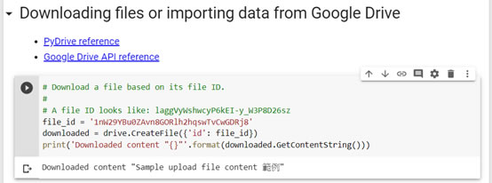

# Google Colaboratory適合Python初學者的雲端開發環境
南華大學跨領域-人工智慧期中報告 11218122 李冠霖 10924251 林旂宇
# Colaboratory簡介

此文章在介紹Google Colaboratory的開發環境與解釋下Hello World等級的機器學習操作過程。

推廣colab並表達這網站對入手程式碼的方便與入門操作。

# Colab Notebook環境介紹
開啟chrome先登入google帳號

進入colab連結URL https://colab.research.google.com/ 

出現對話窗如下


按下右下角 NEW PYTHON 3 NOTEBOOK，出現如下的cell code區域。


點擊 code cell進入編輯模式並貼上這段python程式碼：

```
import numpy
import matplotlib.pyplot as plt

x = numpy.random.normal(5.0, 1.0, 100000)

plt.hist(x, 100)
plt.show()
```

按下左側執行button 或CTRL+Enter。會看到正態分布直方圖結果如下：


Colab有code IntelliSense功能，以上述範例來說，在前面兩行import完numpy等函式庫後，請先按下執行。接著再寫 x= numpy.random.n…編輯器會自動顯示代碼完成，參數信息，快速信息和成員列表等功能

如圖:


滑鼠移至code cell右上角RAM/Disk區域時，會顯示本次執行虛擬機所分配的資源：約12GB RAM，100GB Disk，如下圖。


# 版本比較Revision History
點選工具列File -> Revision History，或直接於主工具列上按下All changes saved，有時會顯示Last saved at…(某時間點)。你會看到幾乎任何時間點的更動都被記錄下來，可以做檔案比較、選擇再次開啟歷史版本或復原版本。


# 於notebook (副檔名.ipynb)中任意加入code cell或text cell
由於Colab是基於Jupyter Notebook發展出來的互動式環境，可以任意加入code cell(使用Python和其他語言編寫和執行代碼)或text cell(使用稱為markdown的簡單標記語言進行格式化筆記)。在下圖中，「下面的global變數x值是由上面這個cell得來，且不用再import函式庫，即可畫出Scatter Plot。」這段敘述是在Text cell中，同樣用點擊區塊方式進入編輯模式。新增這些cells方式也很簡單，將滑鼠移到cell的上方或下方皆可。


接下來編輯執行第二個cell code，程式碼如下：

```
y = numpy.random.normal(10.0, 2.0, 1000)

plt.scatter(x, y)
plt.show()
```

得到錯誤訊息如下圖：


原來是x和y size必須相同。這是很容易修正的錯誤訊息，但是若一時看不出來問題在那兒呢？Colab在ValueError:下提供一個按鈕

，方便我們查詢網站stack overflow的相關解答，非常實用。修改後就可畫出正確分布圖形了：


每一個code cell右上角都具有簡易工具列如下圖，最右邊的More cell actions中有Clear output功能，可快速清理output視窗。


# Mounting Google Drive in your VM

展開Colab notebook左邊的區域，google提供很多方便的Code snippets範例程式碼，我們挑選存取google雲端硬碟的範例實作。


首先要mount上google drive，程式碼如下。
這裡的設定需要綁定權限，請按照指示，連上google oauth2 URL後認證，並複製貼上你的authorization code。


```
from google.colab import drive
drive.mount('/gdrive')
```

當輸入驗證完成，會顯示Mounted at /gdrive，這就表示成功了。


接著在”我的雲端硬碟”中新增檔案foo.txt，並列印出內容。程式碼及執行結果如下：

```
with open('/gdrive/My Drive/foo.txt', 'w') as f:
  f.write('您好 Google Drive!')
!cat '/gdrive/My Drive/foo.txt'
```


但我們其實應該到綁定google帳號的雲端硬碟去檢查，檔案是否真的寫入內容了。


針對google drive的存取，也可以利用python的PyDrive函式庫簡化對Google Drive API的使用，相關範例如下：

```
# Import PyDrive and associated libraries.
# This only needs to be done once in a notebook.
from pydrive.auth import GoogleAuth
from pydrive.drive import GoogleDrive
from google.colab import auth
from oauth2client.client import GoogleCredentials

# Authenticate and create the PyDrive client.
# This only needs to be done once in a notebook.
auth.authenticate_user()
gauth = GoogleAuth()
gauth.credentials = GoogleCredentials.get_application_default()
drive = GoogleDrive(gauth)

# Create & upload a text file.
uploaded = drive.CreateFile({'title': 'PyDriveSample.txt'})
uploaded.SetContentString('Sample upload file content 範例')
uploaded.Upload()
print('Uploaded file with ID {}'.format(uploaded.get('id')))
```


因為會使用Google Cloud SDK，故執行時也會需要輸入驗證碼，此範例會傳回file ID供後續使用。
接下來測試列出.txt檔案，因為在同一本notebook，上面的函式庫及參數可以直接應用：

```
# List .txt files in the root.
# Search query reference:
# https://developers.google.com/drive/v2/web/search-parameters
listed = drive.ListFile({'q': "title contains '.txt' and 'root' in parents"}).GetList()
for file in listed:
  print('title {}, date {}, id {}'.format(file['title'], file['createdDate'], file['id']))
```


  接下來測試下載特定檔案：

```
# Download a file based on its file ID.
# A file ID looks like: laggVyWshwcyP6kEI-y_W3P8D26sz
file_id = '填入你自己的file ID'
downloaded = drive.CreateFile({'id': file_id})
print('Downloaded content "{}"'.format(downloaded.GetContentString()))
```



以上這些檔案操作練習讓我們了解如何使用google drive，之後我們便可將數據資料上傳，以供機器學習使用。

# 初探機器學習
如之前所述，使用Colab完全不需自行安裝TensorFlow等函式庫，直接import即可。現在我們到工具列File->New Python 3 notebook，產生一個新筆記本ML1.ipynb。接著在工具列Runtime -> Change Runtime Type，選擇VM Hardware accelerator。提供的選項有None(由google 配置)、GPU(圖形處理器) 及TPU(張量處理器Tensor Processing Unit)。其中TPU是專為Google的深度學習框架TensorFlow而設計的人工智慧加速器專用積體電路。參考官方文件得知，目前一個虛擬機可提供最長12小時免費使用。在此我們選擇TPU來執行機器學習範例。


我們考慮下面這組數據集，其實可以很快得到這個關係式 Y = 3X + 1。


那麼該如何訓練神經網絡來完成上述關係式？在此應用了一個最簡單的神經網路模型：僅具有單層神經網路，該層具有1個神經元(units=1)，並且其輸入值為單個數據(input_shape=1)，也就是X的值，藉此模型來預測Y的值。

編譯模型時須給入兩個非常關鍵的函數，它們會決定數據如何變化：
損失函數(loss='mean_squared_error')
優化函數(optimizer='sgd' 就是'stochastic gradient descent' )

當機器學習進行訓練時，其中損失函數用來計算這個模型的優劣，之後模型再用優化函數形成新的猜測。本例中，模型會將X不斷帶入Y中並經過100次循環(epochs=100)猜測一個值，然後決定模型的好壞。即使我們現在還不了解數學上的定義也沒關係，因為接下來你會看見真的有用。

請加入這段程式碼並執行：

```
import tensorflow as tf
import numpy as np
from tensorflow import keras

model = tf.keras.Sequential([keras.layers.Dense(units=1, input_shape=[1])])
model.compile(optimizer='sgd', loss='mean_squared_error')

xs = np.array([-1.0, 0.0, 1.0, 2.0, 3.0, 4.0], dtype=float)
ys = np.array([-2.0, 1.0, 4.0, 7.0, 10.0, 13.0], dtype=float)
# 以上code定義此neural network

model.fit(xs, ys, epochs=100)
```

可以看到輸出結果Train on 6 samples及隨著次數增多，越來越低的loss value。到訓練結束時，loss非常小約等於0.0150，表明我們的模型在推斷數字之間的關係方面做得很好。


到此我們先暫停一下，畫張圖：利用線性回歸使用數據點之間的關係，在所有數據點之間畫一條直線。這條線可以用來預測未來值。程式碼如下：

```
import matplotlib.pyplot as plt
from scipy import stats
slope, intercept, r, p, std_err = stats.linregress(xs, ys)

def myfunc(v):
  return slope * v + intercept

mymodel = list(map(myfunc, xs))
plt.scatter(xs,ys,6)
plt.plot(xs, mymodel)
plt.show()
```

執行輸出結果如下圖：


若X=10.0，我們應該很快就認為Y的值是31，那麼來看看經過學習後機器預測的結果吧。

```
print(model.predict([10.0]))
```

結果並不是31，而是30.642574，非常接近31。為什麼呢？因為Neural Networks處理的是機率，在這個例子中只有6對數據，模型只能預測有很高的機率會是直線方程Y = 3X + 1，但不一定，所以機器學習將這個不確定性融入預測中。

本文從Google Colab環境開始介紹，文章後半段則跟大家一起初探Hello World等級的機器學習。撰文的主因是最近太常看到人工智慧及機器學習等相關新聞及討論，尤其在學完芬蘭的免費AI線上課程後，特別想了解如何寫程式應用或做相關研究。當我們發現Colab可方便使用Python及TensorFlow時，真心覺得應該推廣給每個人。


<h2>參考資料:https://www.cc.ntu.edu.tw/chinese/epaper/0052/20200320_5207.html</h2>
